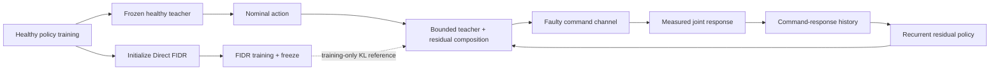

This post supports **English / 中文** switching via the site language toggle in the top navigation.

## TL;DR

A dexterous hand can execute a healthy manipulation policy perfectly until one joint starts receiving altered commands. The object may slip before a conventional fault-diagnosis module has identified the problem. **Residual Fault Adaptation (RFA)** keeps a frozen healthy teacher for nominal behavior and adds a recurrent residual policy that infers corrections from proprioception and command-response history.

Training randomizes six hidden command-channel faults: joint locking, range restriction, intermittent dropout, reduced command gain, command delay, and command bias. An adaptive sampler emphasizes fault modes with lower recent success. A separate Direct FIDR policy supplies a training-only distributional reference through a small KL term; it is absent during deployment.

On a 16-DoF LEAP Hand rotating a cube, RFA reaches **91.26%** post-onset success under a fixed mixed-fault simulation protocol, compared with **87.73%** for the healthy policy and **87.98%** for Direct FIDR. Under healthy actuation it reaches **99.11%**. A targeted real-robot study with software-injected faults demonstrates zero-shot deployment and measures command response and cube rotation; it does not report hardware task-success or contact-force metrics.

## Paper and source version

**Residual Fault Adaptation for Dexterous In-Hand Manipulation Under Runtime Joint Faults** is by **Linan Deng, Xing Liu, Lin Hong, Feng Hua, Guijun Ma, Zuogong Yue, and Fumin Zhang** from the Hong Kong University of Science and Technology and Huazhong University of Science and Technology. These notes follow [arXiv:2609.17404v1](https://arxiv.org/abs/2609.17404), submitted September 15, 2026. See the [paper PDF](https://arxiv.org/pdf/2609.17404). Results below are author-reported.

## 1. The fault is hidden in the command channel

The paper studies a 16-DoF LEAP Hand rotating a cube around the world $z$-axis. The policy produces a normalized relative action $a_t\in[-1,1]^{16}$, which becomes a candidate joint-position target $\hat q_{t+1}$. A runtime fault changes the target delivered to the low-level controller, $\tilde q_{t+1}$, before the measured joint position $q_{t+1}$ responds:

$$
 a_t\rightarrow \hat q_{t+1}\rightarrow \tilde q_{t+1}\rightarrow q_{t+1}.
$$

The deployed policy receives no fault label, affected-joint mask, severity, onset time, or controller-switch signal. It must infer that a command channel has changed from the mismatch between what was requested and what the joints actually did.

This is especially difficult for in-hand manipulation. A single joint can alter several fingertip contacts, redistribute forces, change the available manipulation wrench, and cause a held object to slip. The disturbance also begins mid-episode, after the policy has already established a contact strategy.

## 2. Six runtime fault modes

Each fault instance is defined by the affected joint set $J$, fault mode $\kappa$, severity parameters $\xi$, and onset step $t_{onset}$. The reported training and evaluation distribution uses one affected joint at a time.

| Mode | Command-channel effect |
|---|---|
| Joint locking | Holds the delivered target at the measured position at onset for a sampled duration |
| Range restriction | Projects the target into a reduced joint interval |
| Intermittent dropout | Drops updates and holds the previous delivered target |
| Reduced gain | Delivers only a fraction of the target change |
| Command delay | Delivers an older nominal target from the command history |
| Command bias | Adds a signed offset to the nominal target |

For example, a reduced-gain fault uses

$$
\tilde q_{t+1,j}=\tilde q_{t,j}+g_j(\hat q_{t+1,j}-\tilde q_{t,j}),
$$

while an intermittent dropout uses a Bernoulli update mask $m_{t,j}$:

$$
\tilde q_{t+1,j}=m_{t,j}\hat q_{t+1,j}+(1-m_{t,j})\tilde q_{t,j}.
$$

The fault is sampled at reset but activates later, so every faulted episode begins with healthy actuation and transitions into degraded execution.

## 3. Teacher-anchored residual control

RFA has three training stages.

### Stage I: healthy policy

A recurrent healthy policy $\pi_H$ is trained without runtime faults and then frozen. Its native observation contains three consecutive frames of joint positions and nominal candidate targets:

$$
 o^H_t=[b_{t-2},b_{t-1},b_t],\qquad b_t=[q_t,\hat q_t].
$$

For a 16-DoF hand, this is a 96-dimensional history. The healthy policy supplies the nominal action pathway throughout deployment.

### Stage II: Direct FIDR reference

A second recurrent policy $\pi_F$ is initialized from the healthy checkpoint and trained directly under fault-injection domain randomization (FIDR). It receives a 144-dimensional observation and predicts a complete action under faults. Once trained, it is frozen. Direct FIDR is a distributional reference for Stage III, not a deployed component.

### Stage III: residual policy

The residual policy augments the healthy observation with command-response features:

$$
 e_t=\hat q_t-q_t,\qquad
 \Delta e_t=e_t-e_{t-1},\qquad
 \Delta q_t=q_t-q_{t-1}.
$$

The resulting observation is

$$
 o^R_t=[(o^H_t)^\top,e_t^\top,(\Delta e_t)^\top,(\Delta q_t)^\top]\in\mathbb R^{144}.
$$

These features expose the consequence of a faulty command channel without revealing which fault occurred. A recurrent policy can integrate the deviations over time, so explicit diagnosis is unnecessary.

## 4. Bounded composition and training objective

At each step, the healthy teacher produces a nominal action mean $\mu^H_t$ and the residual policy produces a correction mean $\mu^R_t$. The teacher is clipped to $[-1,1]$ and the residual is passed through a scaled hyperbolic tangent. The correction is then limited by the remaining action headroom:

$$
\mu^C_{t,j}=\tilde\mu^H_{t,j}+\delta_{t,j},
$$

where

$$
\delta_{t,j}=\begin{cases}
\bar\mu^R_{t,j}(1-\tilde\mu^H_{t,j}), & \bar\mu^R_{t,j}\ge 0,\\
\bar\mu^R_{t,j}(1+\tilde\mu^H_{t,j}), & \bar\mu^R_{t,j}<0.
\end{cases}
$$

The composed action remains in $[-1,1]^{16}$. The residual mean head starts at zero, so the initial RFA controller is equivalent to the clipped healthy teacher. This gives training a stable nominal starting point.

RFA is trained with recurrent PPO plus a low-weight KL regularizer on valid fault-active samples:

$$
\mathcal L=\mathcal L_{PPO}+
\frac{\lambda_{ref}}{\max(1,|B_{act}|)}
\sum_{t\in B_{act}}D_{KL}(P^C_t\Vert P^F_t),
$$

with $\lambda_{ref}=0.005$. PPO optimizes task return; the Direct FIDR distribution acts as a fault-conditioned action prior. The KL term is masked out on healthy samples and does not force RFA to imitate Direct FIDR everywhere.

## 5. Adaptive fault sampling

FIDR first randomizes whether an episode is faulted, which joint is affected, the fault mode, its severity, and the onset time. During RFA training, adaptive sampling changes only the relative probabilities of the six fault modes.

For each mode and affected finger group, the sampler tracks an exponential moving average of recent fault-active success. Every 500 environment control steps, difficulty is defined as $d_k=1-\frac{1}{4}\sum_g\hat s_{k,g}$ and the mode probability is normalized as

$$
 w_k=\frac{d_k}{\sum_{k'=1}^{6}d_{k'}}.
$$

A mode with lower recent success receives more training samples. The sampler does not change the probability of an episode being faulted, the severity range, the onset distribution, or the single-joint constraint. The fixed mixed-fault test benchmark uses balanced cases and does not inherit the learned training weights.

This distinction matters. Adaptive sampling is a curriculum mechanism, not an evaluation-time fault detector.

## 6. Simulation protocol and metrics

The simulation uses Isaac Lab, a 30 Hz control loop, 4,096 parallel environments, 20–120 second episodes, and recurrent PPO. Faulted and healthy checkpoints are evaluated without online learning, auxiliary fault diagnosis, ground-truth fault information, or controller switching.

The fixed mixed-fault benchmark balances six modes, all 16 joints, and three normalized severity levels $\alpha\in\{0.25,0.50,0.75\}$. Post-onset evaluation uses a 10-second window. The primary labels are mutually exclusive:

- **Success rate (SR):** the object is not dropped and its mean world-frame $z$-axis rotation rate reaches at least 5°/s;
- **Drop rate (DR):** the object is dropped in the evaluation window;
- **Non-drop failure rate (NDFR):** the object is not dropped but the rotation criterion is not met;
- **Fault-retention ratio (FTR):** mixed-fault SR divided by healthy-condition SR.

The evaluation therefore distinguishes retaining the object from actually continuing the manipulation.

## 7. Main simulation results

| Method | Condition | SR ↑ | DR ↓ | NDFR ↓ | FTR ↑ |
|---|---|---:|---:|---:|---:|
| Healthy policy | Healthy | 97.46% | 1.86% | 0.68% | — |
| Healthy policy | Mixed fault | 87.73% | 1.55% | 10.72% | 90.02% |
| Direct FIDR | Healthy | 99.23% | 0.17% | 0.60% | — |
| Direct FIDR | Mixed fault | 87.98% | 1.82% | 10.20% | 88.65% |
| **RFA** | Healthy | **99.11%** | 0.50% | **0.39%** | — |
| **RFA** | Mixed fault | **91.26%** | **0.83%** | **7.91%** | **92.08%** |

Under mixed faults, RFA improves SR by **3.53 points** over the healthy policy and **3.28 points** over Direct FIDR. It also reduces drop rate and non-drop failure rate. Under healthy actuation, RFA remains close to the best reference and exceeds the healthy checkpoint's SR by 1.65 points.

RFA has the highest mean SR in all six fault categories. The largest degradation of the healthy policy occurs for command bias and range restriction on the index finger, with SR reductions of **51.80** and **36.98** points relative to matched healthy operation. RFA improves SR over the healthy policy in **21 of 24** fault-mode–finger combinations, although the gains are not uniform.

The result is a passive fault-tolerance claim: the deployed controller does not identify the fault explicitly. It uses the time history of command-response mismatch to adjust its action distribution.

## 8. Ablations

The ablations separate the roles of adaptive sampling, command-response features, recurrence, and the reference KL.

| Variant | Mixed-fault SR | DR | NDFR |
|---|---:|---:|---:|
| Direct FIDR | 87.98% | 1.82% | 10.20% |
| RFA, stationary sampling, no KL | 90.01% | 2.27% | 7.72% |
| RFA, adaptive sampling, no KL | 90.96% | 1.62% | 7.42% |
| RFA, stationary sampling, with KL | 90.55% | 1.66% | 7.80% |
| **RFA, adaptive sampling, with KL** | **91.26%** | **0.83%** | 7.91% |
| RFA without command-response block | 89.14% | 1.35% | 9.51% |
| RFA feed-forward residual | 90.46% | 1.73% | 7.81% |

Removing the 48-dimensional command-response block reduces SR by 2.12 points and raises NDFR. Replacing the recurrent residual policy with a feed-forward policy reduces SR by 0.80 points and increases DR. Adaptive sampling contributes mainly through improved success and lower drops. The KL reference shifts the balance between drop and non-drop failures; its effect is not a uniform improvement across every metric.

## 9. Real-robot study and limits

The physical study uses a LEAP Hand with software-injected command-channel faults. The setup records nominal targets, delivered targets, measured joint positions, and cube rotation. The video protocol contains 210 recordings from three controllers, seven conditions, and ten trials per combination. Faulted trials contain pre-fault, fault-active, and recovery intervals.

The pooled rotation rates over faulted trials are:

| Controller | Pre-fault | Fault-active | Recovery |
|---|---:|---:|---:|
| Healthy policy | 20.09 ± 7.58°/s | 16.71 ± 10.54°/s | 20.34 ± 8.50°/s |
| Direct FIDR | 34.11 ± 8.63°/s | 29.23 ± 9.76°/s | 32.89 ± 9.74°/s |
| RFA | 29.27 ± 9.18°/s | 25.37 ± 6.95°/s | 29.01 ± 8.40°/s |

These physical numbers are descriptive because pre-fault rates differ across controllers. The study demonstrates zero-shot deployment and command-response behavior; it does not measure contact force, object drops, or hardware task-success rates.

The scope is also narrow: single-joint software-level command-channel faults. Concurrent multi-joint failures, electrical faults, friction changes, backlash, actuator degradation, and physically induced failures are outside the reported training and evaluation distribution.

My main takeaway is that the teacher–residual composition gives dexterous manipulation a practical passive fault-tolerance interface. The healthy policy preserves nominal behavior, while a recurrent residual learns how a command should change after the measured joints stop following the requested target. The next challenge is recovery that can request a retreat, change the manipulation direction, or re-establish contact after a jam, together with physical fault injection and force sensing.

本文支持通过顶部导航栏进行 **English / 中文** 切换。

## TL;DR

灵巧手可能在健康策略下正常操作，直到某个关节开始接收异常指令。此时，如果等传统 fault-diagnosis module 识别故障，物体可能已经滑落。**Residual Fault Adaptation（RFA）** 保留一个冻结的 healthy teacher 负责 nominal behavior，再加入一个 recurrent residual policy，从 proprioception 和 command-response history 中推断修正量。

训练时随机化六类隐藏的 command-channel fault：关节锁定、关节范围限制、间歇丢包、command gain 降低、command delay 和 command bias。Adaptive sampler 提高近期 success 较低的 fault mode 的采样频率。独立的 Direct FIDR policy 只作为训练阶段的 distributional reference，通过一个小权重 KL 项提供辅助；部署时它不存在。

在 16-DoF LEAP Hand 旋转方块的固定 mixed-fault 仿真协议下，RFA 的 post-onset success 为 **91.26%**，healthy policy 为 **87.73%**，Direct FIDR 为 **87.98%**。健康驱动下 RFA 达到 **99.11%**。针对真实机器人的实验通过 software-injected faults 展示 zero-shot deployment，并记录 command response 和方块旋转；论文没有报告硬件 task-success 或 contact-force 指标。

## 论文与阅读版本

**Residual Fault Adaptation for Dexterous In-Hand Manipulation Under Runtime Joint Faults** 的作者是 **Linan Deng、Xing Liu、Lin Hong、Feng Hua、Guijun Ma、Zuogong Yue 和 Fumin Zhang**，来自香港科技大学和华中科技大学。本文依据 [arXiv:2609.17404v1](https://arxiv.org/abs/2609.17404)，提交日期为 2026 年 9 月 15 日。另见[论文 PDF](https://arxiv.org/pdf/2609.17404)。以下结果均来自作者报告。

## 1. 故障隐藏在 command channel 中

论文研究一个 16-DoF LEAP Hand 绕世界坐标 $z$ 轴旋转方块。Policy 产生归一化的 relative action $a_t\in[-1,1]^{16}$，再转成 candidate joint-position target $\hat q_{t+1}$。Runtime fault 在低层 controller 执行前改变传递到手部的 target $\tilde q_{t+1}$，最终关节位置为 $q_{t+1}$：

$$
 a_t\rightarrow \hat q_{t+1}\rightarrow \tilde q_{t+1}\rightarrow q_{t+1}.
$$

部署时 policy 看不到 fault label、affected-joint mask、severity、onset time 或 controller-switch signal。它只能根据请求的 target 与关节实际响应之间的差异，推断 command channel 已经改变。

这对 in-hand manipulation 尤其困难。单个关节的异常可能改变多个指尖接触、重新分配力、降低可实现的 manipulation wrench，并导致物体滑落。故障还在 episode 中途才发生，此时 policy 已经建立了接触策略。

## 2. 六种 runtime fault

每个 fault instance 由 affected joint set $J$、fault mode $\kappa$、severity parameter $\xi$ 和 onset step $t_{onset}$ 定义。论文训练和评估均使用一次只影响一个关节的设定。

| Mode | Command-channel effect |
|---|---|
| Joint locking | 在 onset 后一段时间把 delivered target 固定在 measured position |
| Range restriction | 把 target 投影到缩小后的 joint interval |
| Intermittent dropout | 丢弃更新并保持之前的 delivered target |
| Reduced gain | 只传递 target change 的一部分 |
| Command delay | 从 command history 中传递更早的 nominal target |
| Command bias | 在 nominal target 上加入带符号 offset |

例如 reduced-gain fault 为

$$
\tilde q_{t+1,j}=\tilde q_{t,j}+g_j(\hat q_{t+1,j}-\tilde q_{t,j}),
$$

而 intermittent dropout 使用 Bernoulli update mask $m_{t,j}$：

$$
\tilde q_{t+1,j}=m_{t,j}\hat q_{t+1,j}+(1-m_{t,j})\tilde q_{t,j}.
$$

Fault 在 reset 时采样，但稍后才激活，因此每个 faulted episode 都先以健康 actuation 开始，再进入 degraded execution。

## 3. Teacher-anchored residual control

RFA 包含三个训练阶段。

### Stage I：healthy policy

首先在没有 runtime fault 的情况下训练 recurrent healthy policy $\pi_H$，然后冻结。它的 native observation 包含连续三帧 joint position 和 nominal candidate target：

$$
 o^H_t=[b_{t-2},b_{t-1},b_t],\qquad b_t=[q_t,\hat q_t].
$$

对于 16-DoF 手，这是 96 维历史信息。Healthy policy 在整个部署过程中提供 nominal action pathway。

### Stage II：Direct FIDR reference

第二个 recurrent policy $\pi_F$ 从 healthy checkpoint 初始化，在 fault-injection domain randomization（FIDR）下直接训练。它接收 144 维 observation，在 fault 下直接预测完整 action。训练完成后冻结。Direct FIDR 只在 Stage III 提供 distributional reference，不参与部署。

### Stage III：residual policy

Residual policy 在 healthy observation 上加入 command-response features：

$$
 e_t=\hat q_t-q_t,\qquad
 \Delta e_t=e_t-e_{t-1},\qquad
 \Delta q_t=q_t-q_{t-1}.
$$

最终 observation 为

$$
 o^R_t=[(o^H_t)^\top,e_t^\top,(\Delta e_t)^\top,(\Delta q_t)^\top]\in\mathbb R^{144}.
$$

这些特征暴露 command channel 的后果，却不告诉 policy 具体 fault。Recurrent policy 能在时间上整合这些偏差，因此不需要显式 diagnosis。

## 4. Bounded composition 与 training objective

每一步中，healthy teacher 产生 nominal action mean $\mu^H_t$，residual policy 产生 correction mean $\mu^R_t$。Teacher 被 clip 到 $[-1,1]$，residual 经过 scaled hyperbolic tangent，再根据剩余 action headroom 限制 correction：

$$
\mu^C_{t,j}=\tilde\mu^H_{t,j}+\delta_{t,j},
$$

其中

$$
\delta_{t,j}=\begin{cases}
\bar\mu^R_{t,j}(1-\tilde\mu^H_{t,j}), & \bar\mu^R_{t,j}\ge 0,\\
\bar\mu^R_{t,j}(1+\tilde\mu^H_{t,j}), & \bar\mu^R_{t,j}<0.
\end{cases}
$$

组合后的 action 始终在 $[-1,1]^{16}$。Residual mean head 从零初始化，因此初始 RFA controller 等价于 clip 后的 healthy teacher，训练从稳定的 nominal behavior 开始。

RFA 使用 recurrent PPO，并在 fault-active sample 上加入低权重 KL regularizer：

$$
\mathcal L=\mathcal L_{PPO}+
\frac{\lambda_{ref}}{\max(1,|B_{act}|)}
\sum_{t\in B_{act}}D_{KL}(P^C_t\Vert P^F_t),
$$

其中 $\lambda_{ref}=0.005$。PPO 优化 task return，Direct FIDR distribution 充当 fault-conditioned action prior。KL 只在 fault-active sample 上计算，不要求 RFA 在所有状态都模仿 Direct FIDR。

## 5. Adaptive fault sampling

FIDR 首先随机化 episode 是否带 fault、affected joint、fault mode、severity 和 onset time。在 RFA training 中，adaptive sampling 只改变六种 fault mode 的相对概率。

对于每个 mode 和 affected finger group，sampler 跟踪近期 fault-active success 的 exponential moving average。每 500 个 environment control step，difficulty 定义为 $d_k=1-\frac{1}{4}\sum_g\hat s_{k,g}$，mode probability 为

$$
 w_k=\frac{d_k}{\sum_{k'=1}^{6}d_{k'}}.
$$

近期 success 较低的 mode 获得更多训练样本。Sampler 不改变 faulted episode 的概率、severity range、onset distribution 或 single-joint constraint。Fixed mixed-fault test benchmark 使用 balanced cases，不继承训练阶段学到的 sampling weights。

这一区分很重要：Adaptive sampling 是 curriculum mechanism，不是测试时的 fault detector。

## 6. 仿真协议与指标

仿真使用 Isaac Lab、30 Hz control loop、4,096 个并行环境、20–120 秒 episode 和 recurrent PPO。Healthy 与 faulted checkpoint 的评估都没有 online learning、辅助 fault diagnosis、ground-truth fault information 或 controller switching。

Fixed mixed-fault benchmark 平衡六种 mode、全部 16 个关节和三个 normalized severity level $\alpha\in\{0.25,0.50,0.75\}$。Post-onset evaluation 使用 10 秒窗口，主要标签互斥定义为：

- **Success rate（SR）**：物体未掉落，且平均世界坐标 $z$ 轴旋转速度至少为 5°/s；
- **Drop rate（DR）**：物体在评估窗口内掉落；
- **Non-drop failure rate（NDFR）**：物体未掉落，但没有达到旋转速度标准；
- **Fault-retention ratio（FTR）**：mixed-fault SR 除以 healthy-condition SR。

这样，评估同时区分了保住物体和继续完成 manipulation。

## 7. 仿真主要结果

| 方法 | Condition | SR ↑ | DR ↓ | NDFR ↓ | FTR ↑ |
|---|---|---:|---:|---:|---:|
| Healthy policy | Healthy | 97.46% | 1.86% | 0.68% | — |
| Healthy policy | Mixed fault | 87.73% | 1.55% | 10.72% | 90.02% |
| Direct FIDR | Healthy | 99.23% | 0.17% | 0.60% | — |
| Direct FIDR | Mixed fault | 87.98% | 1.82% | 10.20% | 88.65% |
| **RFA** | Healthy | **99.11%** | 0.50% | **0.39%** | — |
| **RFA** | Mixed fault | **91.26%** | **0.83%** | **7.91%** | **92.08%** |

在 mixed faults 下，RFA 比 healthy policy 高 **3.53** 个百分点，比 Direct FIDR 高 **3.28** 个百分点，同时降低 drop rate 和 non-drop failure rate。在 healthy actuation 下，RFA 仍接近最好的 reference，并比 healthy checkpoint 高 1.65 个百分点。

RFA 在六类 fault 中都有最高的平均 SR。Healthy policy 受影响最大的是 index finger 上的 command bias 和 range restriction，matched healthy operation 的 SR 分别下降 **51.80** 和 **36.98** 个百分点。RFA 在 24 个 fault-mode–finger 组合中的 **21 个**上比 healthy policy 有更高 SR，但增益并不完全均匀。

这是一种 passive fault-tolerance：部署的 controller 不显式识别 fault，而是使用 command-response mismatch 的时间历史调整 action distribution。

## 8. 消融实验

消融拆分了 adaptive sampling、command-response features、recurrence 和 reference KL 的作用。

| Variant | Mixed-fault SR | DR | NDFR |
|---|---:|---:|---:|
| Direct FIDR | 87.98% | 1.82% | 10.20% |
| RFA，stationary sampling，无 KL | 90.01% | 2.27% | 7.72% |
| RFA，adaptive sampling，无 KL | 90.96% | 1.62% | 7.42% |
| RFA，stationary sampling，有 KL | 90.55% | 1.66% | 7.80% |
| **RFA，adaptive sampling，有 KL** | **91.26%** | **0.83%** | 7.91% |
| RFA 去掉 command-response block | 89.14% | 1.35% | 9.51% |
| RFA feed-forward residual | 90.46% | 1.73% | 7.81% |

去掉 48 维 command-response block 后，SR 下降 2.12 个百分点，NDFR 上升。把 recurrent residual 换成 feed-forward policy 后，SR 下降 0.80 个百分点，DR 上升。Adaptive sampling 主要带来更高 success 和更低 drop。KL reference 的作用更像在 drop 与 non-drop failure 之间重新分配结果，而不是让所有指标统一提升。

## 9. 真实机器人实验与限制

真实实验使用 LEAP Hand 和 software-injected command-channel faults。系统记录 nominal target、delivered target、measured joint position 和 cube rotation。Video protocol 包含 210 段录像，来自三个 controller、七种 condition 和每种组合十次试验。Faulted trial 分为 pre-fault、fault-active 和 recovery 三个时间段。

Faulted trials 的 pooled rotation rate 为：

| Controller | Pre-fault | Fault-active | Recovery |
|---|---:|---:|---:|
| Healthy policy | 20.09 ± 7.58°/s | 16.71 ± 10.54°/s | 20.34 ± 8.50°/s |
| Direct FIDR | 34.11 ± 8.63°/s | 29.23 ± 9.76°/s | 32.89 ± 9.74°/s |
| RFA | 29.27 ± 9.18°/s | 25.37 ± 6.95°/s | 29.01 ± 8.40°/s |

这些真实数据是描述性的，因为三个 controller 的 pre-fault rate 不同。实验展示了 zero-shot deployment 和 command-response behavior，但没有测量 contact force、object drop 或硬件 task-success。

研究范围也比较窄：只考虑 single-joint、software-level 的 command-channel fault。并发多关节故障、电气故障、摩擦变化、backlash、actuator degradation 和物理诱发故障都不在报告的训练与评估分布内。

我的主要 takeaway 是：teacher–residual composition 为灵巧操作提供了一个实际的 passive fault-tolerance interface。Healthy policy 保留 nominal behavior，recurrent residual 则学习当关节不再跟随请求 target 时如何改变动作。下一步需要更强的 recovery policy，使 correction 能够请求后退、改变 manipulation direction 或在卡死后重新建立接触，同时加入物理 fault injection 和 force sensing。

