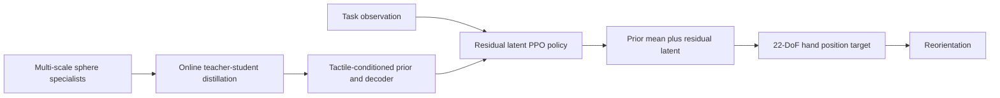

This post supports **English / 中文** switching via the site language toggle in the top navigation.

## TL;DR

Dexterous reorientation is a contact problem disguised as a pose-control problem. A policy must discover finger gaits that keep an object stable while adapting to scale, geometry, contact location, friction, and sensing changes. **TacBPM** learns a tactile-conditioned behavior prior from sphere reorientation specialists, then lets downstream policies act through low-dimensional residual latent commands instead of exploring raw hand joints from scratch.

The prior uses a three-frame tactile-proprioceptive history and a 16-dimensional latent action. Eight sphere teachers cover scale factors from **0.3 to 1.0** of an 8 cm nominal sphere. On unseen scales and non-spherical objects, tactile conditioning raises average success from **40.05%** for the no-tactile variant to **60.38%**. On a five-object complex-object benchmark, the main TacBPM model reaches **70.0%** multi-object success, compared with **1.0%** for raw-action PPO. In a separate arm-hand simulation, success reaches **95.70%–97.56%** across four unseen tool geometries.

## Paper and source version

**TacBPM: A Tactile-conditioned Behavior Prior Model for Dexterous Reorientation** is by **Jie Yin, Wanli Xing, Zeyuan Zhao, Xuezhou Zhu, Zhijie Deng, and Kaifeng Zhang** from Sharpa Robotics. These notes follow [arXiv:2609.18174v1](https://arxiv.org/abs/2609.18174), submitted September 16, 2026. See the [paper PDF](https://arxiv.org/pdf/2609.18174) and [official project page](https://tacbpm.github.io/). Results below are author-reported.

## 1. Reorientation needs a reusable contact strategy

The paper studies three increasingly broad settings. **In-Hand-to-AnyPose** asks a hand to reach arbitrary target orientations from an established grasp. **Axis-Conditioned Rotation** replaces a full target pose with one of six signed Cartesian-axis commands. **Grasp-to-AnyPose** couples arm motion, grasp acquisition, transport, and goal-pose reaching.

A raw 22-DoF position-target policy has to rediscover stable finger gaits for every new object and task. A behavior prior can provide a structured action space, but a useful dexterous prior must react to intermittent fingertip contact, load transfer, contact position, and impending slip. TacBPM therefore conditions its latent controller on touch and proprioception instead of treating the prior as a fixed motion manifold.

## 2. Distill multi-scale specialists into a tactile prior

The in-hand teachers are eight PPO specialists trained in Isaac Sim. They manipulate spheres whose scale factors are $\{0.3,0.4,\ldots,1.0\}$ relative to an 8 cm nominal diameter. Scale changes hand aperture, fingertip placement, rolling, and regrasping while keeping geometry simple. Online multi-teacher distillation interleaves the assigned specialist's target action with the student's rollout, keeping supervision aligned with the states the student actually visits.

Each state stacks three frames of joint positions, previous control targets, five smoothed tactile contact magnitudes, and five 3D tactile contact positions, producing a 192-dimensional tactile-proprioceptive history $x_t$. The encoder sees the task goal during distillation; the prior does not.

TacBPM learns a posterior, a task-agnostic prior, and a decoder:

$$
q_\phi(z_t\mid x_t,g_t)=\mathcal N(\mu^{enc}_t,\operatorname{diag}((\sigma^{enc}_t)^2)),
$$

$$
 p_\theta(z_t\mid x_t)=\mathcal N(\mu^{prior}_t,\operatorname{diag}((\sigma^{prior}_t)^2)),
 \qquad \hat a_t=\pi_\psi(x_t,z_t).
$$

The distillation objective combines action matching, KL regularization, and temporal smoothness:

$$
\mathcal L=\|\hat a_t-a_t^\star\|_2^2+\beta D_{KL}(q_\phi\|p_\theta)+\lambda\|\mu^{enc}_t-\mu^{enc}_{t-1}\|_2^2.
$$

The KL term trains the prior to predict useful latent behavior without the task goal. The temporal term discourages abrupt latent jumps.

## 3. Residual latent control keeps exploration near contact-stable behavior

For a downstream task, the tactile state normalizer and prior network stay frozen. PPO predicts a residual latent action $\Delta z_t$, which is added to the prior mean:

$$
 z_t^{task}=\mu_t^{prior}+\Delta z_t,\qquad
 a_t^{task}=\pi_\psi(x_t,z_t^{task}).
$$

The prior anchors exploration near contact-preserving behavior while the residual selects task-specific deviations. In the main in-hand experiments, the decoder and output head can adapt to new geometry; a frozen-decoder ablation tests stricter reuse. This separates reusable contact behavior from the downstream task objective.

## 4. In-hand transfer across scales and shapes

The first evaluation asks whether a sphere-trained prior transfers to unseen sphere sizes and novel shapes. Raw-action PPO is unstable across most scales under the matched budget. The prior-decoder framework without tactile input already raises seen-scale average success from **26.03%** to **93.67%**. Adding tactile conditioning raises it further to **95.62%**.

The contact shift is more revealing. On unseen scales and additional shapes, the no-tactile variant averages **40.05%** success and **81.16** capped steps. TacBPM reaches **60.38%** and reduces capped steps to **72.71**. The largest weakness remains extrapolation far beyond the teacher family: the 1.2-scale sphere reaches only **13.30%** success, showing that a frozen sphere prior still has a coverage limit.

On five anisotropic objects plus a shared Multi setting, raw-action PPO succeeds only **1.00%** in Multi. Actor-level transfer reaches **40.00%**, and action-space residual learning falls to **8.80%** in Multi. A single-scale prior reaches **65.80%**. TacBPM's main model reaches **70.00%**, while the frozen-decoder variant reaches **73.30%** in Multi. Decoder finetuning helps several individual objects; strict decoder reuse can regularize the shared multi-object policy.

## 5. Commanded-axis rotation and real-robot transfer

Axis-Conditioned Rotation asks one policy to follow six signed commands: $+x$, $-x$, $+y$, $-y$, $+z$, and $-z$. The policy must change both rolling direction and contact strategy while maintaining the grasp. In simulation, TacBPM obtains the highest axis-average rotation on all six evaluated objects. The no-tactile policy often improves over raw-action PPO, which shows that the latent action structure contributes on its own; tactile input adds information when contact regimes vary.

The real setup runs the tactile and proprioceptive policy at 20 Hz on a SharpaWave hand. An episode succeeds when the object rotates more than 180 degrees along the commanded direction within 20 seconds. The authors report strong gains on corner block, small tennis, standard tennis, and an unseen multiface object. For example, on corner block, TacBPM succeeds in **9/10, 8/10, 10/10, 7/10, 10/10, and 7/10** trials for the six signed axes. Failures still arise from contact drift, slow off-axis motion, unusual hand-object configurations, drops, and command-switch transients.

The real experiment is useful because the action loop does not use object-pose feedback. It relies on calibrated tactile forces, contact positions, and proprioception, so the result tests whether the latent prior can remain useful under hardware contact noise.

## 6. Arm-hand Grasp-to-AnyPose

The arm-hand extension trains scale-randomized rubber-hammer teachers and evaluates on four held-out tool geometries: small hammer, blue brush, staples marker, and mallet hammer. The arm must grasp the object, lift and transport it, then reach a sampled goal pose. The separate arm-hand prior is conditioned on arm-hand proprioception, palm pose, object-relative keypoints, and five-fingertip contact signals.

| Object | RL from scratch | TacBPM | TacBPM position error | TacBPM rotation error |
|---|---:|---:|---:|---:|
| Small hammer | 77.73% | **97.56%** | 5.46 cm | 8.48° |
| Blue brush | 27.44% | **95.70%** | 5.55 cm | 11.82° |
| Staples marker | 0.49% | **97.36%** | 4.71 cm | 7.30° |
| Mallet hammer | 91.31% | **96.29%** | 5.55 cm | 10.43° |

The largest gap appears on the staples marker, where raw-action PPO almost never discovers a stable grasp-to-goal behavior within the same training horizon. The paper also shows a qualitative real-robot hammer rollout after simulation-to-real calibration. This is evidence for transfer of the paradigm and complete grasp-lift-goal behavior, while the large quantitative benchmark remains in simulation.

## 7. Strengths and limits

TacBPM's strongest design choice is the division of labor between a frozen contact prior and a task-conditioned residual. The prior compresses reusable finger behavior; the residual preserves room for new goals and geometries. The tactile history makes that prior responsive to current contact rather than tied to one nominal motion pattern. The experiments also test multiple levels of transfer: unseen scales, anisotropic objects, compact axis commands, real hardware, and a separate arm-hand embodiment.

The limitations are equally concrete. Sphere teachers do not cover every contact mode, and performance on the 1.2-scale sphere remains low. The prior is learned and evaluated in simulation-heavy pipelines, with hardware tests using calibrated sensors and a limited object set. Command-switch transitions can still cause drops. The arm-hand real-robot evidence is qualitative, and the method does not yet show long-horizon tool use after reorientation.

My main takeaway is that tactile sensing becomes more valuable when it conditions a reusable action space. TacBPM does not ask downstream PPO to learn every finger motion again; it gives PPO a contact-aware latent neighborhood in which exploration is more likely to preserve the object. The next step is closed-loop task evaluation with richer tactile signals, where success is judged by completing a functional manipulation sequence rather than reaching an orientation alone.

本文支持通过顶部导航栏进行 **English / 中文** 切换。

## TL;DR

灵巧手重定向表面上是姿态控制问题，核心其实是接触问题。策略需要发现能够保持物体稳定的 finger gait，同时适应尺寸、几何、接触位置、摩擦和传感变化。**TacBPM** 从球体重定向 specialists 中学习一个触觉条件行为先验，让下游策略通过低维 residual latent command 控制，而不是每次都从原始关节动作重新探索。

这个先验使用三帧 tactile-proprioceptive history 和 16 维 latent action。八个 sphere teachers 覆盖直径为 **8 cm 标准球体的 0.3–1.0 倍**。在未见过的尺寸和非球体上，加入触觉条件后，平均 success 从无触觉版本的 **40.05%** 提升到 **60.38%**。在五个复杂物体组成的 Multi benchmark 上，主模型达到 **70.0%**，raw-action PPO 只有 **1.0%**。在单独的 arm-hand 仿真中，四类未见工具的 success 达到 **95.70%–97.56%**。

## 论文与阅读版本

**TacBPM: A Tactile-conditioned Behavior Prior Model for Dexterous Reorientation** 的作者是 **Jie Yin、Wanli Xing、Zeyuan Zhao、Xuezhou Zhu、Zhijie Deng 和 Kaifeng Zhang**，来自 Sharpa Robotics。本文依据 [arXiv:2609.18174v1](https://arxiv.org/abs/2609.18174)，提交日期为 2026 年 9 月 16 日。另见[论文 PDF](https://arxiv.org/pdf/2609.18174)和[官方项目页](https://tacbpm.github.io/)。以下结果均来自作者报告。

## 1. 重定向需要可复用的接触策略

论文研究三个逐步扩展的设置。**In-Hand-to-AnyPose** 要求灵巧手从已有 grasp 到达任意目标姿态。**Axis-Conditioned Rotation** 将完整目标姿态换成六个带符号的笛卡尔轴指令。**Grasp-to-AnyPose** 则把机械臂运动、抓取、搬运和目标姿态到达结合起来。

一个 22-DoF 原始动作策略必须为每个新物体和新任务重新发现稳定的 finger gait。行为先验可以提供结构化动作空间，但有用的灵巧操作先验必须响应间歇式指尖接触、负载转移、接触位置和即将发生的滑移。因此，TacBPM 用触觉和本体感觉条件化 latent controller，而不是把先验当作固定的动作流形。

## 2. 从多尺度 specialists 蒸馏触觉先验

In-hand teachers 是在 Isaac Sim 中用 PPO 训练的八个 specialists。它们操作相对于直径 8 cm 标准球体、scale factor 为 $\{0.3,0.4,\ldots,1.0\}$ 的球体。改变尺寸会改变手部张开程度、指尖位置、滚动和重新抓取方式，同时保留简单几何。在线 multi-teacher distillation 将 specialist 在学生 rollout 当前状态下给出的目标动作交错到同一个 batch 中，使监督与学生实际访问的状态保持一致。

每个状态包含三帧关节位置、上一时刻控制目标、五个平滑后的触觉接触强度和五个三维触觉接触位置，得到 192 维 tactile-proprioceptive history $x_t$。蒸馏时 encoder 可以看到任务目标；prior 看不到任务目标。

TacBPM 学习 posterior、task-agnostic prior 和 decoder：

$$
q_\phi(z_t\mid x_t,g_t)=\mathcal N(\mu^{enc}_t,\operatorname{diag}((\sigma^{enc}_t)^2)),
$$

$$
 p_\theta(z_t\mid x_t)=\mathcal N(\mu^{prior}_t,\operatorname{diag}((\sigma^{prior}_t)^2)),
 \qquad \hat a_t=\pi_\psi(x_t,z_t).
$$

蒸馏目标结合 action matching、KL regularization 和 temporal smoothness：

$$
\mathcal L=\|\hat a_t-a_t^\star\|_2^2+\beta D_{KL}(q_\phi\|p_\theta)+\lambda\|\mu^{enc}_t-\mu^{enc}_{t-1}\|_2^2.
$$

KL 项让 prior 在没有任务目标的情况下预测有用 latent behavior；temporal 项则抑制 latent 的突然跳变。

## 3. Residual latent control 把探索保持在稳定接触附近

在下游任务中，tactile state normalizer 和 prior network 保持冻结。PPO 预测 residual latent action $\Delta z_t$，并把它加到 prior mean 上：

$$
 z_t^{task}=\mu_t^{prior}+\Delta z_t,\qquad
 a_t^{task}=\pi_\psi(x_t,z_t^{task}).
$$

先验把探索锚定在保持接触的行为附近，residual 则选择任务相关偏差。在主要 in-hand 实验里，decoder 和 output head 可以针对新几何进行适配；frozen-decoder ablation 用来测试更严格的复用方式。这样，接触行为和下游任务目标被分开处理。

## 4. 跨尺寸和形状的 in-hand transfer

第一个实验测试球体先验能否迁移到未见球体尺寸和新形状。Raw-action PPO 在大多数尺寸上不稳定。在相同训练预算下，不含触觉的 prior-decoder framework 已经把 seen-scale 平均 success 从 **26.03%** 提高到 **93.67%**；加入触觉后进一步提高到 **95.62%**。

接触 regime 变化时，差异更加明显。在未见尺寸和额外形状上，无触觉版本平均 success 为 **40.05%**，capped steps 为 **81.16**；TacBPM 达到 **60.38%**，并把 capped steps 降到 **72.71**。最明显的不足是超出 teacher family 的外推：1.2 倍球体只有 **13.30%** success，说明冻结的 sphere-trained prior 仍受覆盖范围限制。

在五个各向异性物体和一个共享 Multi 设置上，raw-action PPO 的 Multi success 只有 **1.00%**。Actor-level transfer 为 **40.00%**，action-space residual learning 在 Multi 上降到 **8.80%**。Single-scale prior 达到 **65.80%**。TacBPM 主模型达到 **70.00%**，frozen-decoder 版本达到 **73.30%**。Decoder finetuning 能提升若干单物体结果；严格复用 decoder 反而可能对多物体共享策略形成正则化。

## 5. 带指令轴旋转与真实机器人迁移

Axis-Conditioned Rotation 要求一个策略执行六个带符号指令：$+x$、$-x$、$+y$、$-y$、$+z$ 和 $-z$。策略必须在保持抓取的同时改变滚动方向和接触策略。仿真中，TacBPM 在六个物体上都取得最高的 axis-average rotation。无触觉版本通常已经优于 raw-action PPO，说明 latent action structure 本身有帮助；当接触 regime 改变时，触觉提供了额外信息。

真实实验在 SharpaWave 手上以 20 Hz 运行触觉和本体感觉策略。物体沿指令方向旋转超过 180 度且在 20 秒内完成，就算成功。作者报告 TacBPM 在 corner block、small tennis、standard tennis 和未见过的 multiface object 上都有明显提升。例如 corner block 的六个带符号轴分别达到 **9/10、8/10、10/10、7/10、10/10 和 7/10**。剩余失败主要来自接触漂移、偏轴运动过慢、分布外手物构型、掉落和指令切换瞬态。

这个真实实验的价值在于动作循环没有使用物体姿态反馈，而是依赖校准后的触觉力、接触位置和本体感觉。因此，它测试的是 latent prior 在硬件接触噪声下能否继续工作。

## 6. Arm-hand Grasp-to-AnyPose

Arm-hand 扩展使用 scale-randomized rubber-hammer teachers，并在四种 held-out tool geometry 上测试：small hammer、blue brush、staples marker 和 mallet hammer。机械臂需要抓住物体、抬起并搬运，最后到达采样的目标姿态。独立的 arm-hand prior 以 arm-hand proprioception、palm pose、物体相对 keypoints 和五指接触信号作为条件。

| 物体 | 从零训练 RL | TacBPM | TacBPM 位置误差 | TacBPM 旋转误差 |
|---|---:|---:|---:|---:|
| Small hammer | 77.73% | **97.56%** | 5.46 cm | 8.48° |
| Blue brush | 27.44% | **95.70%** | 5.55 cm | 11.82° |
| Staples marker | 0.49% | **97.36%** | 4.71 cm | 7.30° |
| Mallet hammer | 91.31% | **96.29%** | 5.55 cm | 10.43° |

差距最大的是 staples marker：raw-action PPO 几乎无法在相同训练时长内找到稳定的 grasp-to-goal behavior。论文还展示了经过 sim-to-real calibration 后的真实机器人 hammer rollout。这说明该范式可以迁移到完整的 grasp-lift-goal 行为，但大规模定量 benchmark 仍然在仿真中完成。

## 7. 优势与限制

TacBPM 最有价值的设计是把冻结的 contact prior 和 task-conditioned residual 分开。先验压缩可复用的手指行为，residual 为新目标和新几何保留自由度。触觉 history 让先验响应当前接触，而不是绑定某一种 nominal motion pattern。实验也覆盖了多个迁移层级：未见尺寸、各向异性物体、紧凑轴指令、真实硬件和独立的 arm-hand embodiment。

限制也很明确。Sphere teachers 无法覆盖所有接触模式，1.2 倍球体的结果仍然较低。先验主要在仿真流程中学习和评估，硬件实验使用校准后的传感器和有限物体集合。指令切换时仍可能掉落。Arm-hand 的真实机器人证据是定性结果，方法也还没有展示重定向之后的长时序工具使用。

我的主要 takeaway 是：当触觉用来条件化一个可复用的 action space 时，它的价值更容易显现。TacBPM 不要求下游 PPO 再次学习所有 finger motion，而是提供一个更可能保持物体接触的 latent neighborhood。下一步应在更丰富的触觉反馈和闭环任务中验证它，让 success 由完成一段功能性操作来定义，而不只是到达某个物体姿态。

