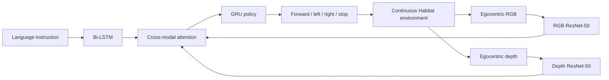
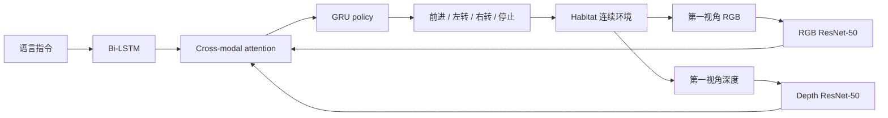

This post supports **English / 中文** switching via the site language toggle in the top navigation.

## TL;DR

Classic Vision-and-Language Navigation (VLN) evaluates an agent on a sparse graph of panoramic viewpoints. The agent chooses a neighboring node, receives a new panorama, and is given precise localization. **VLN-CE**—Vision-and-Language Navigation in Continuous Environments—removes this navigation-graph shortcut. An agent must move through a reconstructed 3D environment using low-level actions, egocentric RGB-D observations, and no location or heading oracle.

The paper transfers Room-to-Room (R2R) instructions into Matterport3D meshes rendered by Habitat. The action space contains `forward 0.25 m`, `turn left 15°`, `turn right 15°`, and `stop`. A trajectory averages **55.88 actions**, compared with **4–6 node hops** in R2R. Only **77%** of R2R trajectories are navigable after transfer, and the resulting task exposes collision avoidance, localization, long-horizon credit assignment, and limited field-of-view.

A cross-modal attention model with depth, data augmentation, progress monitoring, and DAgger reaches **32% success** and **0.30 SPL** on unseen environments. Depth is essential: removing it drives success to roughly chance. The central message is methodological: strong results on a navigation graph do not automatically measure the ability to control a robot in a continuous world.

## Paper and source version

**Beyond the Nav-Graph: Vision-and-Language Navigation in Continuous Environments** is by **Jacob Krantz, Erik Wijmans, Arjun Majumdar, Dhruv Batra, and Stefan Lee**, from Oregon State University, Georgia Tech, and Facebook AI Research. The paper appeared at **ECCV 2020**. These notes follow [arXiv:2004.02857v2](https://arxiv.org/abs/2004.02857), the [ECCV PDF](https://www.ecva.net/papers/eccv_2020/papers_ECCV/papers/123730103.pdf), and the [VLN-CE project page](https://jacobkrantz.github.io/vlnce/). The authors released the [VLN-CE codebase](https://github.com/jacobkrantz/VLN-CE).

## 1. What the navigation graph hides

In graph-based VLN, each node is a 360° panorama captured at a fixed location. Edges define where the agent can go. Choosing an edge implicitly provides three strong assumptions.

First, the topology is known. The agent acts inside a precomputed set of traversable points, even in an unseen test scene. Second, navigation between adjacent nodes is an oracle operation: the agent effectively teleports several meters and avoids obstacles automatically. Third, the agent receives perfect location and heading, which makes geometric reasoning much easier than onboard localization.

These assumptions turn much of the problem into visually guided graph search. They also hide the interface between high-level language reasoning and low-level control. A robot moving through a room must deal with collisions, continuous observations, actuation errors, ambiguous viewpoints, and the possibility of getting stuck.

VLN-CE keeps the language-following goal while exposing these missing parts. The agent receives a natural-language route instruction and must reach the described goal in a continuous 3D scene using egocentric perception alone.

## 2. Construct the benchmark from R2R and Matterport3D

The benchmark uses 90 Matterport3D environments with reconstructed meshes and the Habitat simulator. The authors reuse R2R instructions instead of collecting a new language dataset, which makes the continuous setting comparable to the original graph-based task.

Each R2R panorama node has a coordinate, but that coordinate may lie on furniture, at the camera's elevated tripod height, or inside a reconstruction hole. The conversion procedure casts a vertical ray, searches for a nearby navigable point for a 1.5 m tall and 0.2 m diameter agent, and manually corrects problematic cases. Direct nearest-mesh projection fails for **73%** of nodes; after the vertical projection and review process, **98.3%** of nodes transfer successfully.

The authors then run an A*-based shortest-path check between consecutive transferred waypoints. A trajectory is retained only when the agent can reach each next waypoint within 0.5 m. The final dataset contains **4,475 trajectories** from R2R train and validation splits, each paired with its natural-language instructions and a low-level shortest-path action sequence. About **77%** of the original R2R trajectories are navigable in the continuous reconstruction.

The filtering is itself informative. Some failures come from invalid mesh locations; others arise because the panorama and reconstructed mesh disagree, such as a chair or door being moved between captures. A graph edge can remain manually plausible even when the continuous mesh contains no valid route.

## 3. Observation and action spaces

VLN-CE models a ground robot with a forward-facing RGB-D camera, similar to a LoCoBot. The observation is a $256\times256$ egocentric image with a 90° horizontal field of view. The agent does not receive its global position, heading, or a panoramic view.

The low-level action set is deliberately small:

- move forward **0.25 m**;
- turn left **15°**;
- turn right **15°**;
- stop.

A graph-based R2R trajectory averages four to six node transitions. Its continuous counterpart averages **55.88 low-level actions**. The agent must therefore decide how long to continue forward, when to turn, how to recover from drift, and when it has seen enough of the scene to stop.

The task is evaluated with trajectory length (TL), navigation error (NE), normalized Dynamic Time Warping (nDTW), oracle success (OS), success rate (SR), and success weighted by inverse path length (SPL). SR asks whether the agent reaches the goal; SPL also penalizes unnecessary path length.

## 4. Two baseline architectures

The first model is a sequence-to-sequence policy. An ImageNet-pretrained ResNet-50 encodes RGB features, and a point-goal-navigation ResNet-50 encodes depth. An LSTM encodes the instruction, while a GRU combines the pooled visual features and instruction representation to predict the next action.

The second model adds cross-modal attention. A bidirectional LSTM retains every instruction token. At each step, the model attends to the relevant instruction words, then uses the attended language feature to attend separately to RGB and depth feature maps. A second GRU predicts the action from the attended language, visual and depth features, the previous action, and the first recurrent state.

This structure matters for references such as “turn left at the table.” Mean-pooled features cannot preserve all spatial detail or identify which part of a long instruction is active. Cross-modal attention lets the model focus on the current phrase and the visual region that may ground it.

## 5. Training regimes

The basic policy uses teacher-forcing imitation learning with **inflection weighting**. Actions at turns or other changes receive more weight because long trajectories contain many repeated forward actions.

The paper tests three techniques from graph-based VLN.

**Progress monitoring** adds a regression loss for the fraction of the instruction trajectory completed. It directly supervises where the agent should be along the route and can help decide when to stop.

**DAgger** addresses exposure bias. During data collection, the oracle action is followed with probability $\beta=0.75^n$ at iteration $n$; otherwise the current policy acts. The resulting trajectories are aggregated and used for later imitation learning, so the policy sees states caused by its own mistakes.

**Synthetic data augmentation** converts about **150,000** trajectories generated by an inverse speaker model into additional continuous instruction-trajectory pairs.

These tools do not transfer uniformly. DAgger is consistently useful. Progress monitoring and synthetic augmentation can hurt when used alone, yet their combination followed by DAgger produces the strongest model. The authors attribute part of the progress-monitoring weakness to overfitting on non-augmented data.

## 6. Results in continuous environments

The sequence-to-sequence RGB-D baseline reaches **20% SR** on unseen validation environments and **0.18 SPL**. Removing the instruction, RGB, or depth all hurts. Depth is especially important: the no-depth and no-vision variants perform near chance, because the agent struggles to avoid obstacles and bootstrap stable movement.

| Model / training | Val-unseen SR | Val-unseen SPL |
|---|---:|---:|
| Seq2Seq baseline | 20% | 0.18 |
| Cross-modal attention baseline | 23% | 0.22 |
| Cross-modal + progress monitor | 27% | 0.25 |
| Cross-modal + DAgger | 29% | 0.26 |
| Cross-modal + augmentation | 21% | 0.19 |
| Cross-modal + progress + augmentation + DAgger | **32%** | **0.30** |

The final model has an average path length of about **88 actions** when successful. In qualitative examples, a successful route takes 62 actions even though the corresponding graph path has only three hops. The agent must repeatedly turn until a described hallway becomes visible, actively search for referenced objects, and avoid stopping at a visually plausible but incorrect location.

The model's failures show why continuous evaluation is harder. One agent follows a route through a hallway; another moves toward the wrong windows and stops at a nearby couch instead of first passing the kitchen. With a narrow egocentric view, the agent may never see the object that disambiguates the instruction unless it chooses to look around.

## 7. What happens when continuous paths are projected back to VLN

The authors convert trajectories from their best continuous model back onto the original navigation graph and compare them with graph-based VLN systems. The continuous model reaches only **0.21 SPL** on the VLN test set, while graph-based methods report values near **0.47**.

This is not intended as a leaderboard submission. It is a diagnostic comparison. A model trained without the graph has to handle control and perception continuously; graph-based systems receive the topology, oracle transitions, and precise localization during training and inference. The gap measures how much those assumptions contribute to apparent VLN performance.

The comparison also has caveats. Around 20% of original trajectories are not navigable in the continuous reconstruction and are excluded from VLN-CE. Continuous routes can also pass through areas poorly covered by sparse panoramas. Even with these effects, the paper argues that graph-based results should be interpreted carefully when the goal is instruction-following robots in the physical world.

## 8. Strengths and limitations

The benchmark's main strength is its clean exposure of the control interface. It preserves natural language instructions and realistic scanned scenes while replacing teleportation with low-level movement. Reusing R2R makes the task easy to compare with prior work, and releasing Habitat code enables follow-up studies.

The design also has limitations. The dataset inherits reconstruction artifacts and excludes roughly 23% of transferred R2R trajectories. The action set is discrete and the robot model is simplified, so the benchmark still abstracts away wheel slip, dynamic obstacles, and real sensor noise. The paper's models are end-to-end baselines; modular mapping, planning, and control are left for later work.

My main takeaway is that navigation benchmarks should expose the cost of turning language into movement. VLN-CE makes depth, collision avoidance, long-horizon recovery, and stopping decisions visible. Its approximately one-third success rate is modest compared with graph-based VLN, yet that gap is the useful result: it shows which capabilities remain when the oracle navigation graph is removed.

本文支持通过顶部导航栏进行 **English / 中文** 切换。

## TL;DR

经典 Vision-and-Language Navigation（VLN）通常在稀疏的全景 viewpoint 图上评估 agent。Agent 选择相邻节点，获得新的全景图像，并且知道精确定位。**VLN-CE**（Vision-and-Language Navigation in Continuous Environments）去掉了这层 navigation-graph shortcut：Agent 必须在重建的三维环境中执行低层动作，只依赖第一视角 RGB-D 观测，不能使用位置和朝向 oracle。

论文把 Room-to-Room（R2R）指令迁移到 Habitat 中的 Matterport3D mesh。动作空间包括 `前进 0.25 m`、`左转 15°`、`右转 15°` 和 `停止`。一条轨迹平均需要 **55.88 个动作**，而 R2R 只有 **4–6 次节点跳转**。R2R 轨迹迁移后只有 **77%** 能在连续环境中导航成功，任务因此暴露出碰撞规避、定位、长时域 credit assignment 和有限视野等问题。

使用 cross-modal attention、深度、数据增强、progress monitoring 和 DAgger 的最佳模型，在 unseen 环境达到约 **32% success / 0.30 SPL**。深度是关键输入：去掉深度后 success 接近 chance。论文的核心信息是：在 navigation graph 上取得的高分，不能直接代表机器人在连续世界里控制和跟随指令的能力。

## 论文与阅读版本

**Beyond the Nav-Graph: Vision-and-Language Navigation in Continuous Environments** 的作者是 **Jacob Krantz、Erik Wijmans、Arjun Majumdar、Dhruv Batra 和 Stefan Lee**，来自 Oregon State University、Georgia Tech 和 Facebook AI Research。论文发表于 **ECCV 2020**。本文依据 [arXiv:2004.02857v2](https://arxiv.org/abs/2004.02857)、[ECCV PDF](https://www.ecva.net/papers/eccv_2020/papers_ECCV/papers/123730103.pdf) 和 [VLN-CE 项目页](https://jacobkrantz.github.io/vlnce/)。作者公开了 [VLN-CE 代码库](https://github.com/jacobkrantz/VLN-CE)。

## 1. Navigation graph 隐藏了什么

在 graph-based VLN 中，每个节点是一张固定位置采集的 360°全景图，边表示可通行方向。选择一条边隐含了三个很强的假设。

第一，环境拓扑是已知的。即使是 unseen test scene，Agent 也在预先计算好的可通行点集合中行动。第二，相邻节点之间的导航由 oracle 完成：Agent 实际上可以瞬移几米，并自动避开障碍。第三，Agent 始终获得精确位置和朝向，这比 onboard localization 简单很多。

这些假设把问题很大一部分变成 visually guided graph search，也隐藏了高层语言推理和低层控制之间的接口。真实机器人在房间里运动时必须面对碰撞、连续观测、执行误差、模糊视角和被障碍卡住的情况。

VLN-CE 保留语言跟随目标，同时把这些缺失因素暴露出来。Agent 接收自然语言路线指令，只依赖第一视角观测，在连续三维场景中到达目标。

## 2. 从 R2R 和 Matterport3D 构建 benchmark

Benchmark 使用包含重建 mesh 的 90 个 Matterport3D 环境，并在 Habitat simulator 中运行。作者复用 R2R 指令，没有重新采集语言数据，因此连续设置可以和原始 graph-based 任务直接比较。

每个 R2R panorama node 都有坐标，但坐标可能落在家具上、相机较高的 tripod 高度上，或重建缺口中。迁移过程沿节点位置垂直向下投射射线，为一个高 1.5 m、直径 0.2 m 的 agent 搜索附近可导航点，并人工修正问题节点。直接进行最近 mesh 投影时，**73%** 的节点失败；经过垂直投影和检查后，**98.3%** 的节点成功迁移。

随后，作者用基于 A* 的 shortest-path 检查相邻迁移 waypoint。只有当 Agent 能在 0.5 m 内到达每个下一个 waypoint 时，轨迹才被保留。最终数据集包含来自 R2R train 和 validation split 的 **4,475 条轨迹**，每条轨迹带有原始自然语言指令和由低层动作构成的 shortest path。原始 R2R 轨迹约 **77%** 能在连续重建环境中导航。

过滤结果本身也很有信息量。一部分失败来自无效 mesh 位置，另一部分来自 panorama 与重建 mesh 不一致，例如拍摄之间椅子或门的位置变化。Graph 中一条人工添加的 edge 可能看起来合理，但连续 mesh 中并不存在有效路径。

## 3. Observation 和 action space

VLN-CE 模拟一个带前置 RGB-D 相机的地面机器人，类似 LoCoBot。Observation 是分辨率 $256\times256$、水平视场角 90° 的第一视角图像。Agent 不知道全局位置、朝向，也没有全景视图。

低层动作集合很小：

- 前进 **0.25 m**；
- 左转 **15°**；
- 右转 **15°**；
- 停止。

Graph-based R2R 轨迹平均只有四到六次节点转移；连续版本平均需要 **55.88 个低层动作**。Agent 必须决定前进多久、何时转向、如何从偏差中恢复，以及何时已经看够环境并停止。

评估指标包括 trajectory length（TL）、navigation error（NE）、normalized Dynamic Time Warping（nDTW）、oracle success（OS）、success rate（SR）和 success weighted by inverse path length（SPL）。SR 判断是否到达目标，SPL 还会惩罚不必要的绕路。

## 4. 两种 baseline architecture

第一种模型是 sequence-to-sequence policy。ImageNet 预训练的 ResNet-50 编码 RGB，另一个在 point-goal navigation 上训练的 ResNet-50 编码深度。LSTM 编码 instruction，GRU 将池化后的视觉特征和语言表示结合起来，预测下一步动作。

第二种模型加入 cross-modal attention。双向 LSTM 保留每个 instruction token。在每个时刻，模型先关注相关词语，再用 attended language feature 分别关注 RGB 和 depth feature map。第二个 GRU 根据 attended language、视觉与深度特征、上一动作和第一个 recurrent state 预测动作。

对于“在桌子旁左转”这样的指令，这种结构很有帮助。Mean-pooling 无法保留足够空间细节，也难以确定长指令中当前生效的部分；cross-modal attention 能把当前短语和可能对应的视觉区域联系起来。

## 5. Training regime

基础 policy 使用带 teacher-forcing 的 imitation learning，并采用 **inflection weighting**。在转向等动作发生变化的位置增加权重，因为长轨迹中包含很多重复的前进动作。

论文测试三种来自 graph-based VLN 的方法。

**Progress monitoring** 增加一个回归损失，预测当前完成的轨迹比例，直接监督 Agent 在路线中的位置，也有助于判断何时停止。

**DAgger** 用来缓解 exposure bias。数据采集第 $n$ 轮以 $\beta=0.75^n$ 的概率执行 oracle action，否则执行当前 policy action。采集到的轨迹被聚合后用于后续 imitation learning，因此 policy 能看到由自身错误造成的状态。

**Synthetic data augmentation** 将 inverse speaker model 生成的约 **15 万条**轨迹转换为连续环境中的额外 instruction-trajectory pair。

这些方法的迁移效果并不一致。DAgger 稳定有效；progress monitoring 和 synthetic augmentation 单独使用时可能造成下降，但二者结合后再使用 DAgger 得到最强结果。作者认为，progress monitoring 在没有增强数据时容易过拟合。

## 6. 连续环境结果

带 RGB-D 的 sequence-to-sequence baseline 在 unseen validation 环境达到 **20% SR** 和 **0.18 SPL**。去掉 instruction、RGB 或 depth 都会下降。深度尤其关键：no-depth 和 no-vision 版本接近 chance，因为 Agent 难以避障，也很难建立稳定运动策略。

| 模型 / 训练方式 | Val-unseen SR | Val-unseen SPL |
|---|---:|---:|
| Seq2Seq baseline | 20% | 0.18 |
| Cross-modal attention baseline | 23% | 0.22 |
| Cross-modal + progress monitor | 27% | 0.25 |
| Cross-modal + DAgger | 29% | 0.26 |
| Cross-modal + augmentation | 21% | 0.19 |
| Cross-modal + progress + augmentation + DAgger | **32%** | **0.30** |

最终模型在成功轨迹上的平均长度约为 **88 个动作**。定性案例中，一条成功路线需要 62 个动作，而对应 graph path 只有三个 hop。Agent 必须反复转向直到看到走廊，主动寻找指令中的物体，并避免停在看起来合理但错误的位置。

失败案例也说明了连续评估的难度：一个 Agent 成功穿过走廊，另一个 Agent 朝错误的窗户移动，在先经过厨房之前就停在附近沙发旁。第一视角范围有限，如果 Agent 没有主动环顾，就可能始终看不到用于消歧的物体。

## 7. 把连续轨迹投回 VLN 会发生什么

作者把最佳连续模型产生的轨迹重新投影到原始 navigation graph，并与 graph-based VLN 系统比较。连续模型在 VLN test 上只有 **0.21 SPL**，而 graph-based 方法报告的数值接近 **0.47**。

这不是为了提交 leaderboard，而是一个诊断比较。连续模型在训练和推理时都没有 graph，需要同时处理控制和感知；graph-based 系统在训练和推理中获得拓扑、oracle transition 和精确定位。这个差距显示了这些假设对 VLN 表面成绩的贡献。

比较也有明确限制：原始轨迹约 20% 在连续重建环境中不可导航，并被 VLN-CE 排除；连续路线还可能经过稀疏 panorama 覆盖不足的区域。即使考虑这些因素，论文仍认为，当目标是让机器人在真实世界跟随指令时，应谨慎解读 graph-based 结果。

## 8. 优势与限制

Benchmark 的主要优势是清楚暴露了 control interface。它保留自然语言和真实扫描场景，同时把 teleportation 换成低层移动。复用 R2R 让结果容易和已有工作比较，公开 Habitat 代码也方便后续研究。

限制同样明确。数据集继承了重建伪影，约 23% 的 R2R 迁移轨迹被排除。动作是离散的，机器人模型也经过简化，因此仍然没有覆盖轮滑、动态障碍和真实传感噪声。论文中的模型是 end-to-end baseline，模块化 mapping、planning 和 control 留给后续工作。

我的主要 takeaway 是：导航 benchmark 需要暴露把语言转成运动的真实代价。VLN-CE 让深度、碰撞规避、长时域恢复和停止决策变得可见。它约三分之一的 success 低于 graph-based VLN，但这个差距正是有价值的结果：去掉 navigation graph 的 oracle 后，哪些能力仍然存在，哪些能力还没有解决，都变得清楚了。

